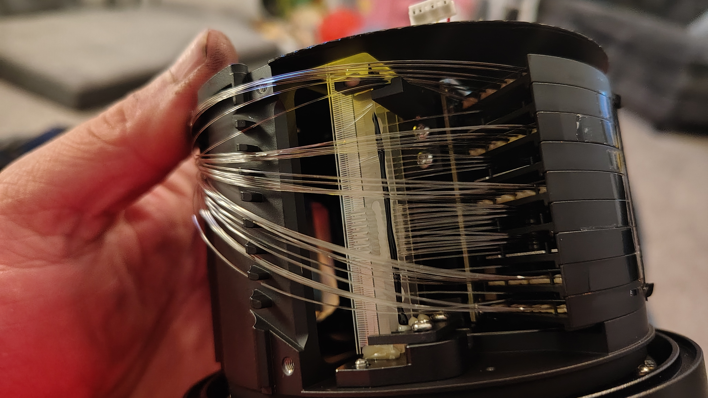

# Pandar40P Mobile Mapping Rig

A DIY walk-around 3D mapping system: a surplus **Hesai Pandar40P** 40-channel lidar
(fleet pull, **100BASE-T1 automotive Ethernet variant**) on a tilted mast, pushed on a
jogging stroller, running real-time lidar-inertial SLAM on a gaming laptop, producing
dense colorized point clouds, meshes, and Gaussian splats.

> **It maps, and the map is metrically checked.** Scale is verified against a
> taped floor→ceiling of 3.0607 m: the map reads **3.0445 ± 0.0035 m, −0.53 %**.
> A 234 m outdoor sidewalk loop closes to **1.277 m, 0.55 % of path** — and only
> 10 cm of that is vertical, because gravity anchors that axis. Getting there took
> five distinct fixes, none of which announced itself, plus a sixth found later:
> see [docs/fastlio_setup.md](docs/fastlio_setup.md) and
> [docs/imu_extrinsic.md](docs/imu_extrinsic.md).
>
> *(An earlier version of this line quoted a doorway at 0.77 m against 0.813 m
> "nominal". That is retracted — the nominal was wrong. The door is a 28-inch
> slab, not 32-inch, and the measurement was taken in a ~46° tilted view. Scale
> was never the problem.)*

> **The T1 discovery:** these fleet-surplus Pandar40Ps are NOT defective when they
> show "no link" on a normal NIC — they speak 100BASE-T1 (single-pair automotive
> Ethernet, Broadcom **BCM89811** PHY, confirmed by teardown). A ~$100 T1→TX media
> converter bridges them to any laptop. See [docs/t1_ethernet.md](docs/t1_ethernet.md).


*Unit #1 gave its life for science — full teardown with photos in [docs/teardown/](docs/teardown/README.md).*

## System overview

```
STROLLER MAST (~2 m, braced)                       LAPTOP (stroller seat)
┌─────────────────────────────┐                    i7-12650H · RTX 4060 · 32 GB
│ Pandar40P (fwd tilt)        │── T1 pair ──► T1/TX converter ──► GbE NIC
│ ICM-42688-P ── XIAO ESP32-S3│────────── USB ──► /imu/data_raw (200 Hz)
│   (co-mounted under lidar)  │
│ 2× ELP OG02B10 GS cameras   │────────── USB ──► colorization frames
│ u-blox M10 GNSS             │──── via XIAO ───► /gps/fix
└─────────────────────────────┘
12 V flooded deep-cycle ── fuse ── rig            Ubuntu 22.04 · ROS 2 Humble
  └ INA226 + ESP32-C6 monitor (hardware ALERT)     FAST-LIO2 live · GLIM offline
```

## Quick start (bench)

1. Wire power: 12 V (9–48 V OK), 3 A fuse → red+gray = V+, black+gray/white = GND.
**No power switch — it spins on connect. Remove the lens film first.**
2. Wire data: lidar T1 pair → converter terminal block → RJ45 → laptop.
3. `sudo scripts/network/setup_lidar_nic.sh <iface>` (sets 192.168.1.100/24)
4. `scripts/capture/find_lidar.sh <iface>` — confirms UDP on :2368 and reveals the
sensor's actual IP (fleet units may not be at the 192.168.1.201 default).
5. Web control: `http://192.168.1.201`. Audit it read-only with
`python3 scripts/diagnostics/lidar_config.py`. **If every range reads zero, it is
`NoiseFiltering`, not dead hardware** — confirmed 2026-08-01, and one call undoes
it (note the firmware's spelling):
```bash
curl -s "http://192.168.1.201/pandar.cgi?action=set&object=lidar_data&key=noise_filtring&value=0"
```
Full console reference: [docs/lidar_console.md](docs/lidar_console.md).
6. Full procedure: [docs/bench_test_checklist.md](docs/bench_test_checklist.md)

## Quick start (mapping)

Workspace built per [docs/fastlio_setup.md](docs/fastlio_setup.md) — the driver
config and two small FAST-LIO2 source patches there are **required**, not optional.
XIAO plugged in before launch (bridge hardcodes `/dev/ttyACM0`).

```bash
# record a run — hold still for the first 3–5 s (gravity/bias init)
ros2 launch launch/rig.launch.py record:=true

# replay through the mapper — absolute config path is required
ros2 launch fast_lio mapping.launch.py \
  config_file:=/home/lidar/ros2_ws/src/FAST_LIO/config/pandar40p.yaml
ros2 bag play ~/bags/<run_dir>

# export the map (FAST-LIO2's own pcd_save doesn't work here)
python3 scripts/diagnostics/save_map.py 0.02 ~/map.pcd
```

## Repo map

| Path                     | What                                                             |
| ------------------------ | ---------------------------------------------------------------- |
| `docs/`                  | Build guide, bench checklist, pinout, T1 notes, SLAM setup, extrinsic notes, teardown |
| `hardware/`              | BOM + wiring references                                          |
| `patches/`               | FAST-LIO2 source patches for the Hesai driver's point format     |
| `scripts/network/`       | NIC setup, PTP master, lidar discovery                           |
| `scripts/capture/`       | rosbag2 recording helpers                                        |
| `scripts/diagnostics/`   | rclpy topic-inspection tools + PCD export (the `ros2` CLI is unreliable on the rig laptop) |
| `scripts/postprocess/`   | offline pipeline notes/stubs (GLIM → HBA → cleanup)              |
| `firmware/imu_bridge/`   | XIAO ESP32-S3 + ICM-42688-P USB timestamping bridge (PlatformIO) |
| `firmware/battery_monitor/` | ESP32-C6 + INA226 pack monitor with a hardware low-voltage ALERT |
| `ros2/imu_bridge_node/`  | laptop-side serial→`sensor_msgs/Imu` publisher                   |
| `ros2/lidar_temp_node/`  | polls the lidar console for die temperature → `/lidar/temperature` |
| `ros2/rig_status_node/`  | aggregates all rig state and serves it as JSON on :8080          |
| `ros2/config/`           | Hesai driver + FAST-LIO2 configs, `ptp4l` master config          |
| `launch/`                | `rig.launch.py` — driver + RViz + bridge + optional bag record   |

## Status

- [x] Lidar #1: teardown (T1 PHY identified — BCM89811); parts donor
- [x] Lidar #2: bench test passed — zero-ranges trap traced to `NoiseFiltering=1`, reproducible on demand and reversible without a factory reset ([docs/lidar_console.md](docs/lidar_console.md))
- [x] T1 media converter: BUELEC 100/1000Base-T1-TX-E — in service (100M / MASTER / orange pair)
- [x] IMU bridge: ICM-42688-P on XIAO ESP32-S3, 200 Hz, units verified (rad/s, m/s²)
- [x] IMU co-mounted under the lidar — **reseated 2026-07-31** after the first mount proved 14.4° crooked about X; the estimator now lands within 0.65° of identity on every axis
- [x] Timestamp domains unified (`use_timestamp_type: 1`; PTP is the later upgrade)
- [x] FAST-LIO2 patched for the Hesai point format ([patches/](patches/))
- [x] **First indoor SLAM run — multi-room map; scale verified −0.53 % against a taped ceiling**
- [x] PCD export pipeline (`scripts/diagnostics/save_map.py`)
- [x] **Frame drop solved** — `SensorDataQoS()` (BEST_EFFORT depth 5) was silently discarding up to two-thirds of the cloud; reliable QoS takes it to 99.4 %, and scale improved −1.92 % → −0.53 % with it
- [x] Mast + stroller build — jogger stroller, pneumatic tires; measured peak 32.59 m/s² = 42 % of ±8 g full scale, so **rubber isolators are not needed**
- [x] Extrinsic refinement — **R resolved**, identity confirmed by measurement. **T is not observable in this data** and rests on the tape: `[-0.057, -0.023, 0.047]`
- [x] IMU noise characterization — 8.58 h static capture; every axis beats the datasheet on white noise. `allan_variance_ros` is ROS 1 only, so `scripts/diagnostics/allan.py` does it directly from the `.db3`
- [x] **First outdoor capture with loop closure** — 234 m sidewalk loop, **0.55 % drift**, frame accounting held at 99.8 %
- [x] Thermal + status monitoring — `/imu/temperature`, `/lidar/temperature`, and a JSON status endpoint on :8080
- [ ] Camera aim → panel bond → intrinsics → lidar-camera calibration *(bandwidth cleared: both cameras sustain 3200×1200 at 15 fps with no effect on IMU timing)*
- [ ] Battery monitor wiring (INA226 + ESP32-C6 — firmware built and flashed, awaiting the shunt)
- [ ] PTP time sync, revert to sensor timestamps — **deferred**: no PTP hardware on any interface here, and it buys ~0.4 mm against 1,277 mm of measured drift
- [ ] Offline chain: GLIM → HBA → dynamic removal → colorize

## Docs index

- [**Command cheatsheet — record, replay, diagnose**](docs/commands.md)
- [Build guide (full plan, quality tiers)](docs/build_guide.md)
- [Bench test checklist](docs/bench_test_checklist.md)
- [**Lidar web console reference**](docs/lidar_console.md)
- [**FAST-LIO2 setup + debugging history**](docs/fastlio_setup.md)
- [**IMU mounting + extrinsic verification**](docs/imu_extrinsic.md)
- [Zoox fleet-variant quirks](docs/zoox_quirks.md)
- [Cable pinout + Ethernet wiring](docs/pinout.md)
- [Automotive Ethernet / T1 notes](docs/t1_ethernet.md)
- [Teardown notes (unit #1)](docs/teardown/README.md)
