# Pandar40P Teardown — Unit #1 (fleet variant, Dec 2021)

Unit #1 ("no Ethernet") was opened after a replacement shipped. The autopsy proved
it was never defective — it speaks 100BASE-T1 automotive Ethernet
(see [../t1_ethernet.md](../t1_ethernet.md)).

Curated hero shots are committed in `img/`; full 72-photo albums:
*TODO: add imgur album links.*

## The discovery that mattered

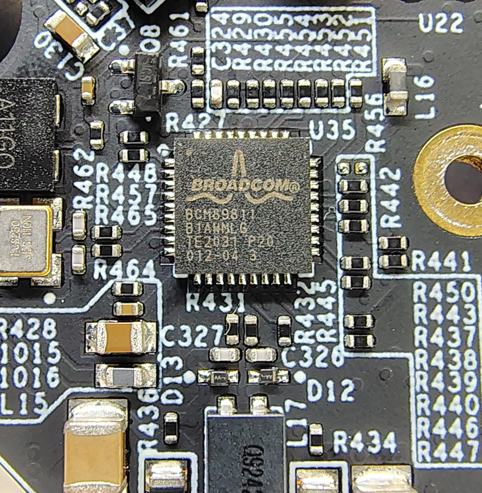

**Broadcom BCM89811** on the stator board — a 100BASE-T1 PHY. This single chip
marking reframed the "defect": the sensor was speaking single-pair automotive
Ethernet the whole time, invisible to a standard laptop NIC. A T1↔TX media
converter is the fix, not a return.

## Architecture findings

### Optical path: 40 lasers by fiber

Each of the 40 laser channels launches into a bare **optical fiber**; the loom
routes every fiber to a central vertical **emitter tower**, where 40 fiber tips
form the tightly spaced vertical array (0.33° in the dense band). You can't stack
40 laser diodes that densely — but you can stack 40 fiber tips.

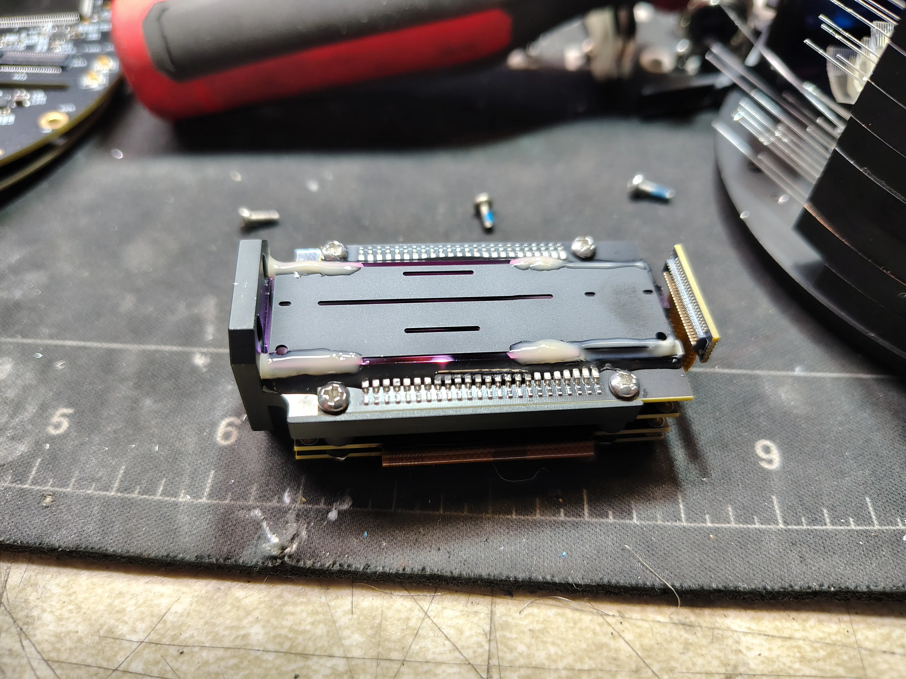
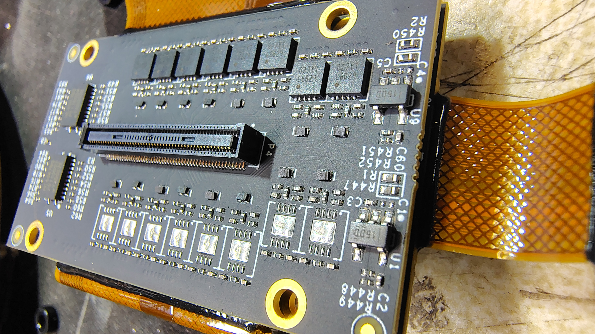

### Drive electronics: wedge segmentation

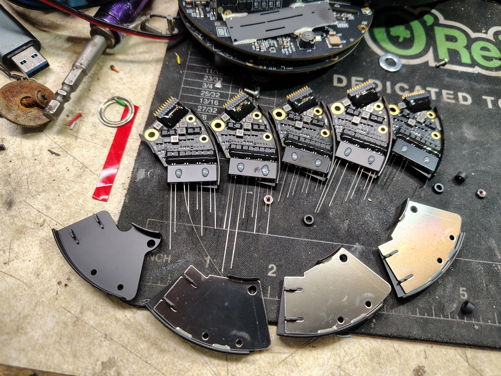

The channel driver electronics tile the rotor circumference as five wedge-shaped
boards (1 µH drive inductors, long pin combs), each with a stamped shield cover.

### Receive/mux chain

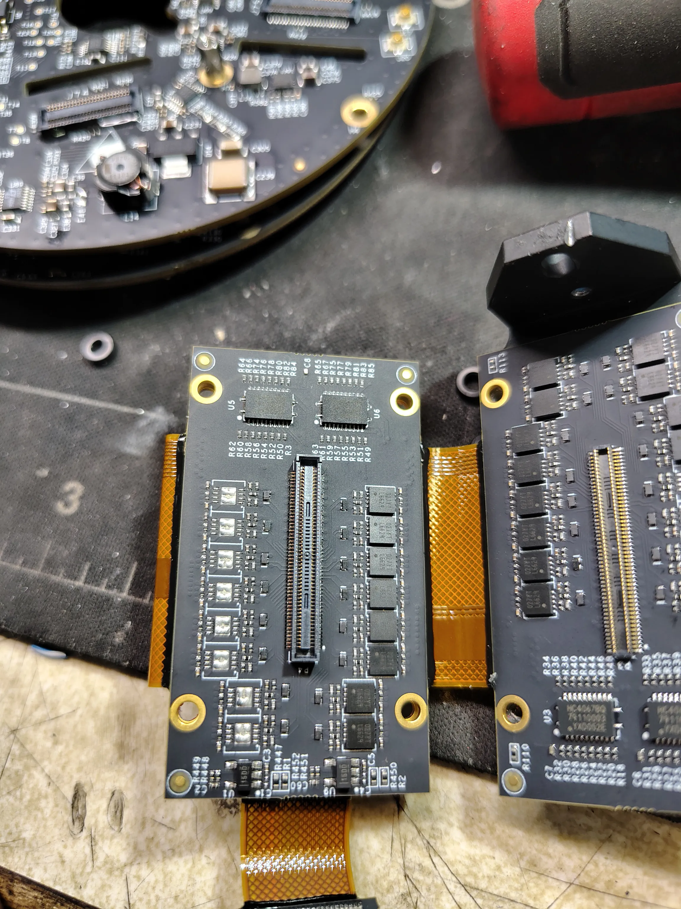
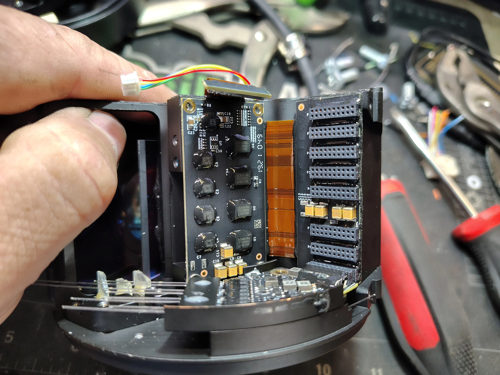

Banks of detectors are multiplexed (ADG658 8:1) through AD8370 variable-gain amps
into shared digitizers — per-shot gain instead of 40 parallel ADCs. HC4067 16-ch
muxes sequence the transmit side. Boards interconnect via fine-pitch mezzanine
connectors and flex; silkscreen family `HSM5_*`.

### Compute: Xilinx on both sides of the rotary joint

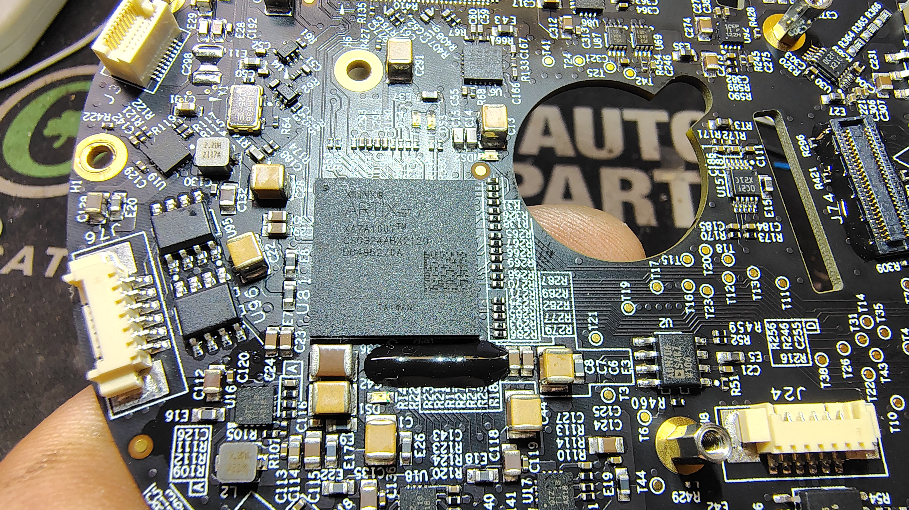
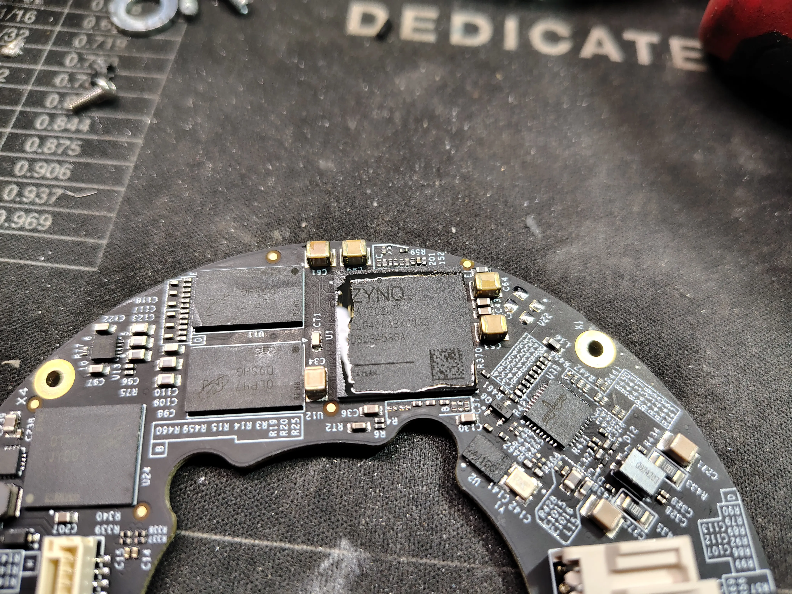
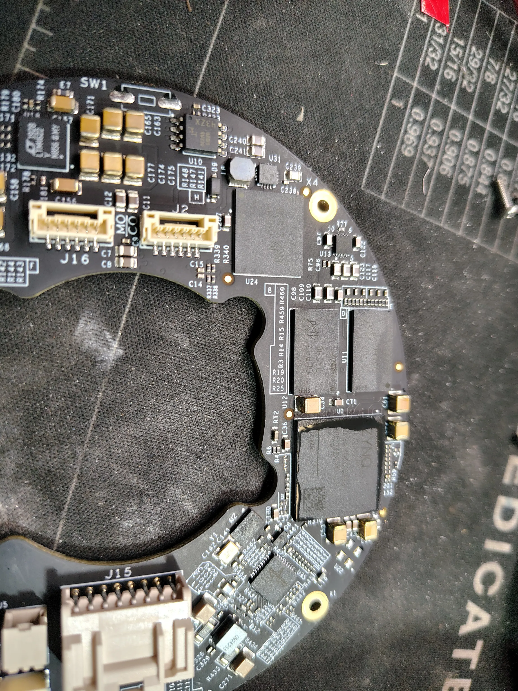

- **Rotor:** Artix-7 **XA7A100T** (automotive grade) — laser sequencing,
  return capture, data packing.
- **Stator:** Zynq **XA7Z020** SoC (ARM + FPGA, automotive grade) with Micron
  DDR3 alongside — the sensor's main computer: packet building, web control/PTC,
  clock sync, and the Broadcom PHY sits nearby on the same board.

### Motor

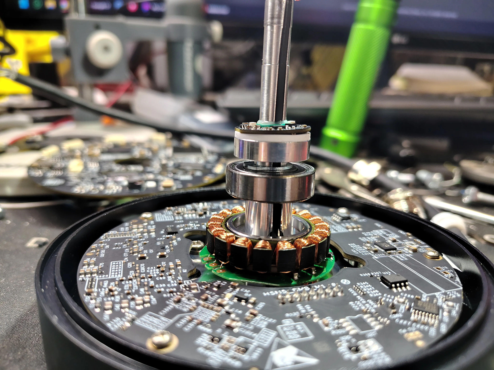

Flat pancake BLDC stator around the central shaft, preloaded bearing pair, and a
small round board riding the shaft — encoder/index. (Rotary power/data coupling
mechanism: still TODO — photograph the stator mating face under the rotor's gold
ring, and both spin-axis centers, to settle inductive vs optical.)

### Optics salvage

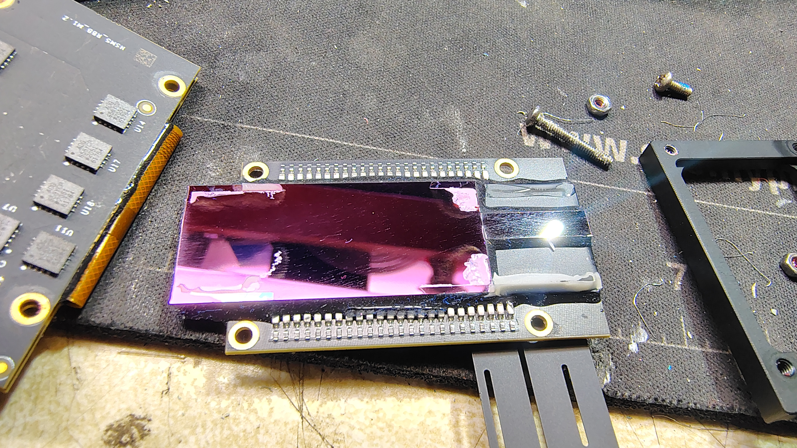

Two large 905 nm AR-coated aspherics (emit collimator + receive collector) plus
dielectric fold mirrors / filter flats — pink/purple in visible light because
their coatings are tuned for 905 nm. Lens uses: IR laser collimation (808 nm
projects), receiver optics, near-IR imaging (SV205 + IR-pass filter).
Extraction rule: sacrifice the mount, never pry the glass.

## Open questions
- Rotary joint mechanism (inductive rings vs axial optical link) — needs the two
  mating-face photos.
- 128-pin "MXT200I 2048" on the TMB — suspected high-speed link/SerDes; unidentified.
- Unpopulated U.FL footprints (J17/J20) — factory test / variant provisioning.

## Safety notes for anyone repeating this
- **Never power the unit open:** 40 invisible ~905 nm pulsed emitters; the Class 1
  rating applies to the intact housing only.
- The fiber loom is the most fragile assembly — a kinked/cracked fiber is a dead
  channel, unrepairable.
- Four small holes on the top cap accept a pin spanner (threaded cap).
